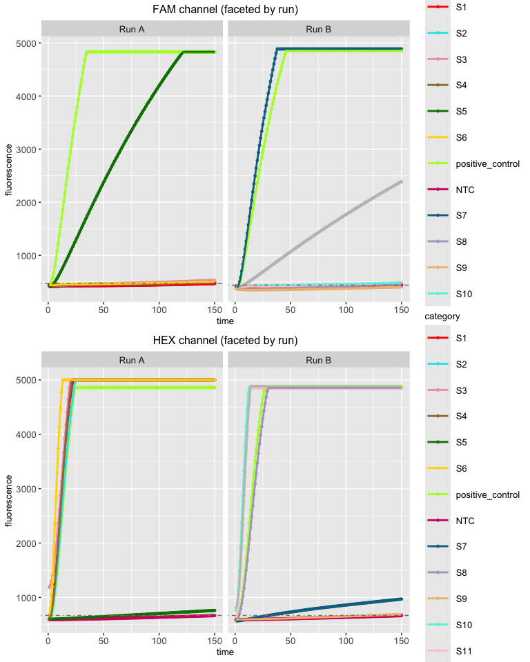
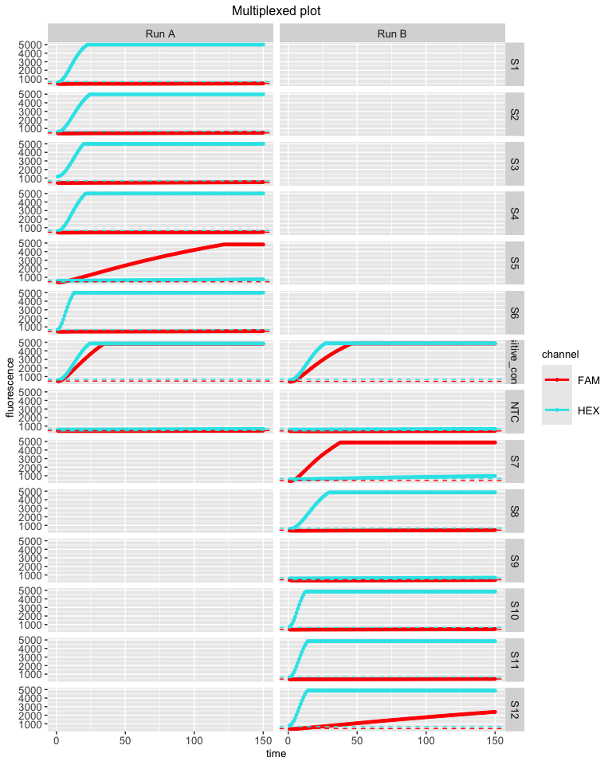

Axxin T8 diagnostic plots
================
2024-06-29

An R script to visually assess data generated by and exported from Axxin
T8 in Excel format. The Excel files from multiple T8 runs are the input
files for this script. The output of this script is a PDF file
containing sample statistics and diagnostic plots for assessing run
quality.

``` r
# Load required libraries
packages <- c("data.table", "dplyr", "tidyr", "ggplot2",
              "gridExtra", "cowplot", "qpdf", "grid", 
              "readxl", "rio", "tibble", "tcltk")

# Loop through vector, install and load if missing, otherwise load if present
for (package in packages) {
  if (!package %in% installed.packages()) {
    # Install
    install.packages(package, dependencies=T)
  }
  
  if (!package %in% .packages()) {
    # Load
    library(package, character.only=T)
  }
}
```

    ## 
    ## Attaching package: 'dplyr'

    ## The following objects are masked from 'package:data.table':
    ## 
    ##     between, first, last

    ## The following objects are masked from 'package:stats':
    ## 
    ##     filter, lag

    ## The following objects are masked from 'package:base':
    ## 
    ##     intersect, setdiff, setequal, union

    ## 
    ## Attaching package: 'gridExtra'

    ## The following object is masked from 'package:dplyr':
    ## 
    ##     combine

``` r
# Read sheet(s) into list
myinput <- tk_choose.files()
outputdir <- unique(paste0(dirname(myinput), "/", "t8_assessment_output"))

# Create output directory if not present
if (file.exists(outputdir)){ 
  setwd(outputdir) 
} else { 
  dir.create(outputdir) 
}
```

``` r
## Function to process each Excel file separately
process_excel <- function(myfile) {
  
  # Read in runs (sheets)
  runs_list <- import_list(myfile, header=F)
  
  # Extract sample names (last sheet)
  samples_df <- runs_list[[length(runs_list)]]
  runs_list <- runs_list[-length(runs_list)]
  
  # Extract run names (Test ID column)
  run_names <- vector()
  for (i in seq_along(runs_list)) {
    testid <- runs_list[[i]] %>% 
      filter(`...1`=="Test Name (Run ID)") %>% pull(`...2`)
    run_names[[i]] <- testid 
  }
  
  # Check if header is present
  if (samples_df[1,1] == "axxin_name") {
    colnames(samples_df) <- samples_df[1,]
    samples_df <- samples_df[-1, ]
  } else {
    # Extract run names
    colnames(samples_df) <- c("axxin_name", run_names)
  }
  
  samples_df <- samples_df %>%
    pivot_longer(-axxin_name, values_to="sample", names_to="run")
  
  # Loop through each sheet, extract data rows
  results <- list()
  
  # This is to run on runs_list
  for (i in seq_along(runs_list)) {
    #runname <- names(runs_list)[[i]]
    runname <- runs_list[[i]] %>% filter(`...1`=="Test Name (Run ID)") %>% pull(`...2`)
    start <- grep("^Headings", runs_list[[i]][, 1])
    end <- grep("\\^\\^\\^\\^\\^", runs_list[[i]][, 1]) - 1
    df <- runs_list[[i]][start:end, ]
    
    # Remove rows 2 & 3, columns 1 & 2 & last column (temperature)
    df <- df[-c(2,3), -c(1,2,ncol(df))]
    
    # Set header row
    names(df) <- df[1,]
    df <- df[-1,]
    
    # Remove mS columns and transpose
    df <- df[, seq(2,ncol(df),2)]
    # df <- df %>% 
    #   mutate(timepoint = seq(length=nrow(df)))
    rownames(df) <- seq(length=nrow(df))
    df <- t(df)
    df <- rownames_to_column(as.data.frame(df), "axxin")
    # Add run name so can match to different sample setups for different runs within an Excel sheet
    df$run <- runname
    
    # Replace axxin column names with sample names, add to df
    channel <- c("FAM", "HEX")
    tmp <- expand_grid(samples_df, channel)
    tmp <- tmp %>% 
      mutate(axxin=paste(axxin_name, "-", channel, sep="")) %>%
      select(-axxin_name)
    
    df <- df %>%
      left_join(tmp, by=c("axxin"="axxin", "run"="run")) %>%
      #mutate(run=runname) %>% 
      relocate(run, channel, sample) %>%
      select(-axxin)
    results[[i]] <- df
  }
  results_final <- rbindlist(results, fill=T)
  results_final
}

# Apply function
finalres <- rbindlist(lapply(myinput, process_excel), fill=T)
```

    ## New names:
    ## New names:
    ## New names:
    ## • `` -> `...1`
    ## • `` -> `...2`
    ## • `` -> `...3`
    ## • `` -> `...4`
    ## • `` -> `...5`
    ## • `` -> `...6`
    ## • `` -> `...7`
    ## • `` -> `...8`
    ## • `` -> `...9`
    ## • `` -> `...10`
    ## • `` -> `...11`
    ## • `` -> `...12`
    ## • `` -> `...13`
    ## • `` -> `...14`
    ## • `` -> `...15`
    ## • `` -> `...16`
    ## • `` -> `...17`
    ## • `` -> `...18`
    ## • `` -> `...19`
    ## • `` -> `...20`
    ## • `` -> `...21`
    ## • `` -> `...22`
    ## • `` -> `...23`
    ## • `` -> `...24`
    ## • `` -> `...25`
    ## • `` -> `...26`
    ## • `` -> `...27`
    ## • `` -> `...28`
    ## • `` -> `...29`
    ## • `` -> `...30`
    ## • `` -> `...31`
    ## • `` -> `...32`
    ## • `` -> `...33`
    ## • `` -> `...34`
    ## • `` -> `...35`

``` r
# Remove any NA values (resulting from discrepancies in timepoints)
# Maximum timepoint retained where data is available for all runs
finalres <- finalres %>%
  select_if(~ !any(is.na(.)))
```

``` r
axxin <- finalres %>% 
  pivot_longer(-c("run", "channel", "sample"), names_to="time", values_to="fluorescence")

axxin$time <- as.numeric(axxin$time)
axxin$fluorescence <- as.numeric(axxin$fluorescence)

# Define color vector
my_colours <- c(
  "#FF0000","#2BE4E9", "#F19CBB", "#9C7C38", "#008000", "#FFD700", "#ADFF2F", "#D5006A", "#107090", "#B1A2CA","#EFBE7D","#61F4DE","#FFCACA", "#C0C0C0", "#acff80", "#FF0000", 
  "#008080", "#BA55D3", "#000000","#2F4F4F", "#D8BFD8", "#FF4500", "#00FF7F", "#87CEFA",   "#E9EC6B", "#00FF00","#FF1493",
  "#4D4DFF","#6B8E23", "#FF7540", "#FF00FF")


## Add sample category for faceting
axxin <- axxin %>% 
  mutate(category=sample) %>%
  filter(sample!="nil")

fwrite(axxin, file=paste0(outputdir, "/axxin_df.tsv"), sep="\t", col.names=T, row.names=F, quote=F)
```

``` r
# Function for getting NTC thresholds
get_thresholds_ntc <- function(mydf) {
  dataset <- deparse(substitute(mydf))
  res <- mydf %>%
    filter(toupper(sample) == "NTC") %>%                         
    group_by(channel, run) %>%
    summarize(mean_ntc=mean(fluorescence),
              median_ntc=median(fluorescence),
              min_ntc=min(fluorescence),
              max_ntc=max(fluorescence),
              sd_ntc=sd(fluorescence),
              threshold_2sd=mean_ntc+2*sd_ntc,
              threshold_3sd=mean_ntc+3*sd_ntc,
              threshold_5sd=mean_ntc+5*sd_ntc) %>%
    mutate(dataset=dataset) %>%
    relocate(dataset)
  print(res)
  
  table <- tableGrob(res)
  h <- grobHeight(table)
  title <- textGrob("NTC thresholds", y=unit(0.5,"npc") + 1*h,
                    vjust=0, gp=gpar(fontsize=14))
  gt <- gTree(children=gList(table, title))
  pdf(paste0(outputdir, "/thresholds_table.pdf"), height=nrow(table)/2, width=14)
  grid.draw(gt)
  #grid.table(combined_thresholds, title)
  dev.off()
  res
  
}

combined_thresholds <- get_thresholds_ntc(axxin)
```

    ## `summarise()` has grouped output by 'channel'. You can override using the
    ## `.groups` argument.

    ## # A tibble: 4 × 11
    ## # Groups:   channel [2]
    ##   dataset channel run   mean_ntc median_ntc min_ntc max_ntc sd_ntc threshold_2sd
    ##   <chr>   <chr>   <chr>    <dbl>      <dbl>   <dbl>   <dbl>  <dbl>         <dbl>
    ## 1 axxin   FAM     Run A     444.       440.     427     473   14.1          472.
    ## 2 axxin   FAM     Run B     414.       411      400     440   12.4          439.
    ## 3 axxin   HEX     Run A     625.       622.     594     666   22.2          669.
    ## 4 axxin   HEX     Run B     624.       622.     594     666   22.3          669.
    ## # ℹ 2 more variables: threshold_3sd <dbl>, threshold_5sd <dbl>

``` r
# Function for getting sample statistics

get_samplestats <- function(mydf) {
  dataset <- deparse(substitute(mydf))
  res <- mydf %>%
    filter(sample!="NTC") %>% 
    group_by(channel, sample, run) %>%
    summarize(mean=mean(fluorescence),
              median=median(fluorescence),
              min=min(fluorescence),
              max=max(fluorescence),
              sd=sd(fluorescence)) %>%
    mutate(dataset=dataset) %>%
    mutate_if(is.numeric, format, 2) %>%
    relocate(dataset)
  
  table <- tableGrob(res)
  h <- grobHeight(table)
  title <- textGrob("Sample stats", y=unit(0.5,"npc") + 1*h,
                    vjust=0.5, gp=gpar(fontsize=14))
  gt <- gTree(children=gList(table, title))
  pdf(paste0(outputdir, "/samplestats_table.pdf"), height=nrow(table)/2, width=12)
  grid.draw(gt)
  #grid.table(combined_stats)
  dev.off()
}

samples_df <- axxin %>%
  filter(channel=="FAM") %>%
  select(channel, category) %>%
  distinct()

head(samples_df)
```

    ## # A tibble: 6 × 2
    ##   channel category
    ##   <chr>   <chr>   
    ## 1 FAM     S1      
    ## 2 FAM     S2      
    ## 3 FAM     S3      
    ## 4 FAM     S4      
    ## 5 FAM     S5      
    ## 6 FAM     S6

``` r
## Make plots
plot_fam <- function(df, mycolumn) {
  #mydataset <- deparse(substitute(df))
  
  # If column=run, color by sample
  # If column=sample, color by run
  
  if (mycolumn == "run") {
    colorvariable <- "category"
    facetvariable <- "run"
    
    mean_threshold <- combined_thresholds %>% 
      filter(channel=="FAM") %>%
      mutate(linecolor="1") %>%
      select(run, threshold_2sd, linecolor)
    
    hlinevariable <- "linecolor"
    legendorder <- unique(samples_df$category)
    facetorder <- unique(samples_df$category)
    
  } else if (mycolumn == "category") {
    colorvariable <- "run"
    facetvariable <- "category"
    
    mean_threshold <- combined_thresholds %>% 
      filter(channel=="FAM") %>%
      group_by(run) %>%
      mutate(linecolor=run) %>%
      select(run, threshold_2sd, linecolor)
    
    hlinevariable <- "linecolor"
    #mydf <- df %>% filter(channel=="FAM")
    legendorder <- unique(df$run)
    facetorder <- unique(samples_df$category)
  } else {
    stop("Error")
  }
  
  mydf <- df %>% filter(channel=="FAM")
  mydf$category <- factor(mydf$category, levels=facetorder)
  
  if (mycolumn == "run") {
    rowcount <- ceiling(length(unique(mydf$run))/6)
  } else if (mycolumn == "category") {
    rowcount <- ceiling(length(unique(mydf$category))/6)
  } else {
    stop("Error")
  }
  
  famplot <- mydf %>%
    ggplot(aes(x=time, y=fluorescence, fill=.data[[colorvariable]], color=.data[[colorvariable]], group=interaction(.data[[colorvariable]], sample))) +
    geom_point(size=1) +
    geom_line(linewidth=1) +
    geom_hline(data=mean_threshold, aes(yintercept=threshold_2sd, color=.data[[hlinevariable]]), linetype=4, size=0.5) +
    scale_color_manual(values=my_colours, breaks=legendorder) +
    scale_fill_manual(values=my_colours, breaks=legendorder) +
    
    facet_wrap(as.formula(paste("~", facetvariable)), nrow=rowcount) +
    ggtitle(paste("FAM channel", " (faceted by ", mycolumn, ")", sep="")) +
    theme(plot.title=element_text(hjust=0.5, size=12), strip.text.x = element_text(size=10),
          legend.text=element_text(size=10), axis.text=element_text(size=10), 
          legend.title=element_text(size=10), axis.title=element_text(size=10),
          legend.key.size = unit(1, "cm"))
  famplot
}

plot_hex <- function(df, mycolumn) {
  #mydataset <- deparse(substitute(df))
  
  # If column=run, color by sample
  # If column=sample, color by run
  
  if (mycolumn == "run") {
    colorvariable <- "category"
    facetvariable <- "run"
    
    mean_threshold <- combined_thresholds %>% 
      filter(channel=="HEX") %>%
      mutate(linecolor="1") %>%
      select(run, threshold_2sd, linecolor)
    
    hlinevariable <- "linecolor"
    legendorder <- unique(samples_df$category)
    facetorder <- unique(samples_df$category)
    
  } else if (mycolumn == "category") {
    colorvariable <- "run"
    facetvariable <- "category"
    
    mean_threshold <- combined_thresholds %>% 
      filter(channel=="HEX") %>%
      group_by(run) %>%
      mutate(linecolor=run) %>%
      select(run, threshold_2sd, linecolor)
    
    hlinevariable <- "linecolor"
    legendorder <- unique(df$run)
    facetorder <- unique(samples_df$category)
    
  } else {
    stop("Error")
  }
  
  mydf <- df %>% filter(channel=="HEX")
  mydf$category <- factor(mydf$category, levels=facetorder)
  
  if (mycolumn == "run") {
    rowcount <- ceiling(length(unique(mydf$run))/6)
  } else if (mycolumn == "category") {
    rowcount <- ceiling(length(unique(mydf$category))/6)
  } else {
    stop("Error")
  }
  
  hexplot <- mydf %>%
    ggplot(aes(x=time, y=fluorescence, fill=.data[[colorvariable]], color=.data[[colorvariable]], group=interaction(.data[[colorvariable]], sample))) +
    geom_point(size=1) +
    geom_line(linewidth=1) +
    geom_hline(data=mean_threshold, aes(yintercept=threshold_2sd, color=.data[[hlinevariable]]), linetype=4, size=0.5) +
    scale_color_manual(values=my_colours, breaks=legendorder) +
    scale_fill_manual(values=my_colours, breaks=legendorder) +
    
    facet_wrap(as.formula(paste("~", facetvariable)), nrow=rowcount) +
    ggtitle(paste("HEX channel", " (faceted by ", mycolumn, ")", sep="")) +
    theme(plot.title=element_text(hjust=0.5, size=12), strip.text.x = element_text(size=10),
          legend.text=element_text(size=10), axis.text=element_text(size=10), 
          legend.title=element_text(size=10), axis.title=element_text(size=10),
          legend.key.size = unit(1, "cm"))
  hexplot
}

famhexplot_runfacet <- grid.arrange(plot_fam(axxin, mycolumn="run"), plot_hex(axxin, mycolumn="run"), nrow=2)
```

    ## Adding missing grouping variables: `channel`

    ## Warning: Using `size` aesthetic for lines was deprecated in ggplot2 3.4.0.
    ## ℹ Please use `linewidth` instead.
    ## This warning is displayed once every 8 hours.
    ## Call `lifecycle::last_lifecycle_warnings()` to see where this warning was
    ## generated.

    ## Adding missing grouping variables: `channel`

<!-- -->

``` r
famhexplot_samplefacet <- grid.arrange(plot_fam(axxin, mycolumn="category"), plot_hex(axxin, mycolumn="category"), nrow=2)
```

<!-- -->

``` r
# Save famhexplot_runfacet with the calculated width
ggsave(paste0(outputdir, "/famhexplot_runfacet.pdf"), famhexplot_runfacet, width = 13, height = 15, units = "in", dpi=600)
ggsave(paste0(outputdir, "/famhexplot_samplefacet.pdf"), famhexplot_samplefacet, width = 13, height = 15, units = "in", dpi=600)
```

``` r
## Multiplexed plots
plot_multiplex <- function(df) {
  #plot_title <- deparse(substitute(df))
  df$category <- factor(df$category, levels=unique(samples_df$category))
  multiplot <- df %>%
    #mutate(dataset=plot_title) %>%
    left_join(select(combined_thresholds, channel, run, threshold_2sd), by=c("channel", "run")) %>%
    ggplot(aes(x=time, y=fluorescence, color=channel, group=interaction(sample, channel))) +
    geom_line(linewidth=1) + 
    geom_point(size=1, pch=21, aes(color=channel, fill=channel)) +
    geom_hline(aes(yintercept=threshold_2sd, color=channel), linetype=2) +
    scale_fill_manual(values=my_colours) +
    scale_color_manual(values=my_colours) +
    ggtitle("Multiplexed plot") +
    theme(plot.title=element_text(hjust=0.5, size=12), strip.text = element_text(size=10),
          legend.text=element_text(size=10), axis.text=element_text(size=10), 
          legend.title=element_text(size=10), axis.title=element_text(size=10),
          legend.key.size = unit(1, "cm")) +
    facet_grid(category ~ run)
  multiplot
}

multiplexplot <- plot_multiplex(axxin)
multiplexplot
```

<!-- -->

``` r
# Save famhexplot_runfacet with the calculated width
ggsave(paste0(outputdir, "/multiplexplot.pdf"), multiplexplot, width = 14, height = 15, units = "in", dpi=600)
```

``` r
## Time to significance plots
plot_time2signif <- function(mydf) {
  
  df2plot <- mydf %>%
    #mutate(dataset=mydataset) %>%
    left_join(combined_thresholds, by=c("channel", "run")) %>%
    mutate(newtime=round(time/3, 2)) %>%
    mutate(pass_threshold_2sd=case_when(fluorescence>threshold_2sd ~ "yes", TRUE ~ "no")) %>%
    filter(pass_threshold_2sd=="yes") %>% 
    select(channel, run, sample, category, newtime, fluorescence, starts_with("pass")) %>%
    pivot_longer(starts_with("pass"), names_to="threshold") %>%
    filter(value=="yes") %>%
    group_by(sample, category, run, channel, threshold, value) %>% 
    filter(row_number()==1)
  
  df2plot$category <- factor(df2plot$category, levels=unique(samples_df$category))
  
  plot <- df2plot %>%  
    ggplot(aes(x=reorder(sample, desc(sample)), y=newtime, fill=channel)) + 
    geom_bar(stat="identity", aes(fill=channel), position="dodge") + 
    geom_text(aes(label=newtime), size=1, position=position_dodge(width=0.9), hjust=-0.1) + 
    ylab("Time to significance (min)") +
    xlab("Sample") +
    ggtitle("Time to significance") +
    scale_fill_manual(values=my_colours) +
    scale_color_manual(values=my_colours) +
    theme(plot.title=element_text(hjust=0.5, size=12), strip.text = element_text(size=10),
    legend.text=element_text(size=10), axis.text=element_text(size=10), 
    legend.title=element_text(size=10), axis.title=element_text(size=10),
    legend.key.size = unit(1, "cm"), legend.position="bottom") +
    facet_wrap(.~run, scales="free") + 
    coord_flip() 
  plot
}

time2signifplot <- plot_time2signif(axxin)
time2signifplot
```

<!-- -->

``` r
width_facet_count <- length(unique(axxin$run))
width_for_runfacet <- (2 * width_facet_count) + 1

ggsave(paste0(outputdir, "/time2signif.pdf"), time2signifplot, width = 10, height = 6, units = "in", dpi=600)
```

``` r
# Combine plots into one pdf
# First ensure no existing runsummary file present
file.remove(paste0(outputdir, "/t8_runsummary.pdf"))
pdf_combine(input=paste0(outputdir, "/", list.files(outputdir, pattern="*.pdf")),
            output=paste0(outputdir, "/t8_runsummary.pdf"))

filestoremove <- paste0(outputdir, "/", list.files(outputdir, pattern="*.pdf"))
filestoremove <- filestoremove[!grepl("runsummary", filestoremove)]
filestoremove <- filestoremove[!grepl("samplefacet", filestoremove)]  

file.remove(filestoremove)
```
